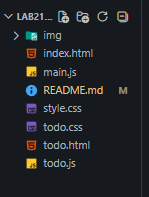

# Лабораторная работа №21. Создание приложения TODO

## Основная информация

**ФИО:** Ханов Владислав Вячеславович
**Группа:** ИСП-231

**Дата:** 24.03.2026

## Краткое описание работы

В ходе выполнения лабораторной работы было создано простое приложение TODO-лист. В процессе работы изучены основы работы с DOM: поиск и создание элементов, обработка событий, работа с формами, динамическое обновление интерфейса.

## Структура проекта

